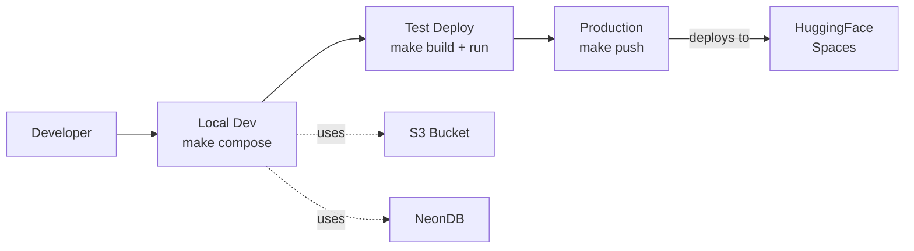
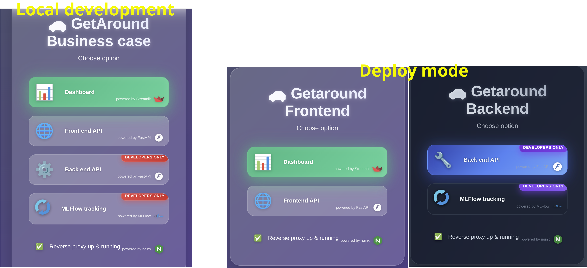
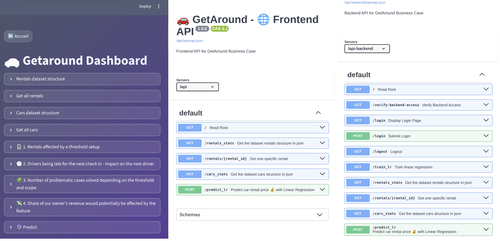

# GetAround - MLOps Deployment Framework

> **3-phases Docker deployment template (local → predeploy → cloud) demonstrating 
> production-grade MLOps architecture on a rental optimization business case.**

---
# Table of Contents

- [GetAround - MLOps Deployment Framework](#getaround---mlops-deployment-framework)
- [Table of Contents](#table-of-contents)
  - [🎯 About](#-about)
  - [🎯 Project Goals](#-project-goals)
  - [⚙️ Tech Stack](#️-tech-stack)
  - [✨ Key Features](#-key-features)
    - [**Deployment Framework:**](#deployment-framework)
    - [**MLOps Pipeline:**](#mlops-pipeline)
    - [**Code Quality:**](#code-quality)
  - [Architecture Overview](#architecture-overview)
  - [Preview](#preview)
  - [📚 Project docs](#-project-docs)
  - [🚀 Getting Started](#-getting-started)
  - [🤝 Contributing](#-contributing)
  - [📜 License](#-license)
  - [🎓 Portfolio Context](#-portfolio-context)
  - [Author](#author)


## 🎯 About
**Business context** (2-3 lignes seulement) :
GetAround rental delays impact user satisfaction and revenue. This project implements 
ML-based delay prediction and threshold optimization.

**Technical focus** :
Production-ready MLOps template showcasing:
- 3-phases deployment workflow (local dev → predeploy validation → HF Spaces)
- Microservices architecture (FastAPI + Streamlit + MLflow + Nginx)
- Reproducible ETL pipelines with experiment tracking

## 🎯 Project Goals
1. **Architecture**: Build reusable multi-container deployment template
2. **MLOps**: Implement complete ML lifecycle (ETL → training → serving → monitoring)
3. **Business**: Predict rental delays and optimize minimum delay thresholds

## ⚙️ Tech Stack

[](https://www.linux.org/) [](https://www.python.org/downloads/) [](https://www.docker.com/) [](https://fastapi.tiangolo.com/) [](https://streamlit.io/) [](https://nginx.org/) [](https://mlflow.org/) [](https://neon.tech/) [](https://aws.amazon.com/) [](https://huggingface.co/spaces)


## ✨ Key Features

### **Deployment Framework:**
- **3-phase workflow**: `make compose` (local) → `make build` (test) → `make push` (prod)
- **Single-port access** via Nginx reverse proxy
- **Environment-aware** configuration (.env switching)

### **MLOps Pipeline:**
- **Complete ETL** with S3 + NeonDB integration
- **MLflow** experiment tracking
- **FastAPI** REST endpoints
- **Streamlit** dashboard

### **Code Quality:**
- **Microservices architecture** (FastAPI + Streamlit + MLflow)
- **Modular** backend/frontend separation
- **Docker Compose** orchestration
- **Makefile** automation
  
[⬆ Back to top](#table-of-contents)

## Architecture Overview


**Full details:** [Architecture docs →](docs/01-architecture.md)

[⬆ Back to top](#table-of-contents)

## Preview




[⬆ Back to top](#table-of-contents)

## 📚 Project docs

* [Architecture](docs/01-architecture.md) - Project structure, microservices topology, and deployment diagrams
* [Prerequisites](docs/02-prerequisites.md) - Bucket (dataset + artifact root) and tracking uri setup
* [Local development](docs/03-local_development.md) - Howto build and run local development environment (notebooks + docker compose)
* [Pipeline ETL & ML + utils](docs/04-pipeline.md) - Core libraries implemented for the project
* [Deployment](docs/05-deployment.md) - Howto build and run of deployment containers (local predeploy + cloud deploy stages)

[⬆ Back to top](#table-of-contents)

## 🚀 Getting Started

- **Set up**
  **Prerequisites** (30-60 min) → [Setup cloud resources](docs/02-prerequisites.md)
    * Linux (bash shell)
    * Python 3.8+
    * pip
    * Docker with Compose V2
    * AWS account (for S3 bucket): see more info [Prerequisites](docs/02-prerequisites.md#aws-s3-bucket)
    * Database (NeonDB or SQLite): see more info [Prerequisites](docs/02-prerequisites.md#postgresql-database)
    * Hugging Face account: see more info [Prerequisites](docs/02-prerequisites.md#huggingface-account)

   **Local Development** (30 min) → [Run locally](docs/03-local_development.md)  
   **Deployment** (60 min) → [Deploy to production](docs/05-deployment.md)

- **Or just explore:**
  ```bash
  git clone https://github.com/f-msngr/ml-getaround-docker-deploy.git
  cd ml-getaround-docker-deploy
  make  # See all commands
  ```

[⬆ Back to top](#table-of-contents)

## 🤝 Contributing

Contributions are welcome! Feel free to open issues or submit pull requests.

## 📜 License

This project is licensed under the GPL3 License — see the [LICENSE](./LICENSE) file for details.

[⬆ Back to top](#table-of-contents)

## 🎓 Portfolio Context
**Project Type:** MLOps Architecture & Deployment Framework  
**Focus:** Production deployment patterns over ML sophistication

**Demonstrates:**
- Multi-phase deployment workflow design (local → cloud)
- Microservices orchestration (Docker Compose + Nginx)
- MLOps best practices (tracking, serving, monitoring)
- Infrastructure as Code (Makefile automation)
- Cloud deployment (HuggingFace Spaces multi-container)

## Author

**Fabien Messinger** — Data Engineer, certified AI Architect (RNCP7, Jedha)
[GitHub](https://github.com/f-msngr) · [LinkedIn](https://www.linkedin.com/in/fabien-messinger)

[⬆ Back to top](#table-of-contents)