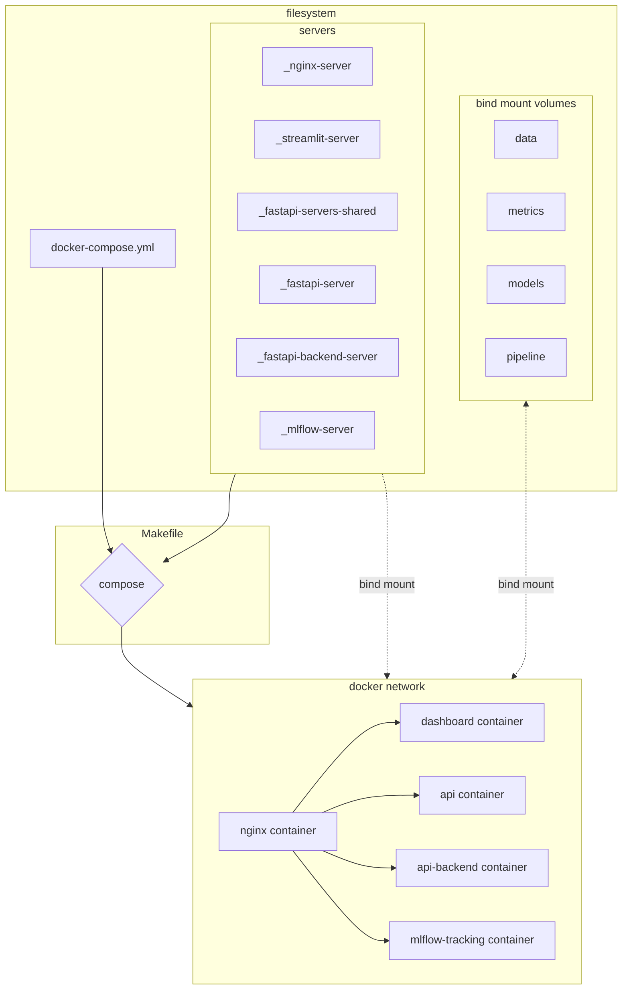
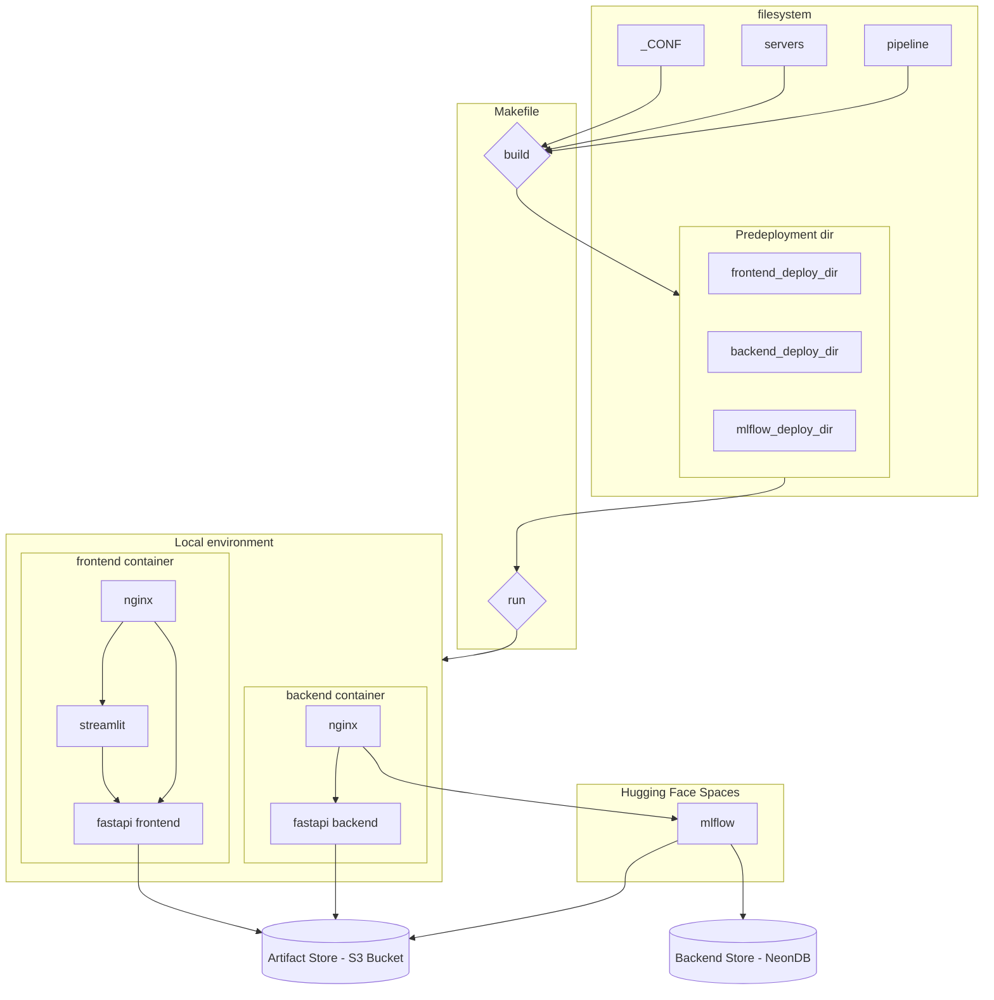
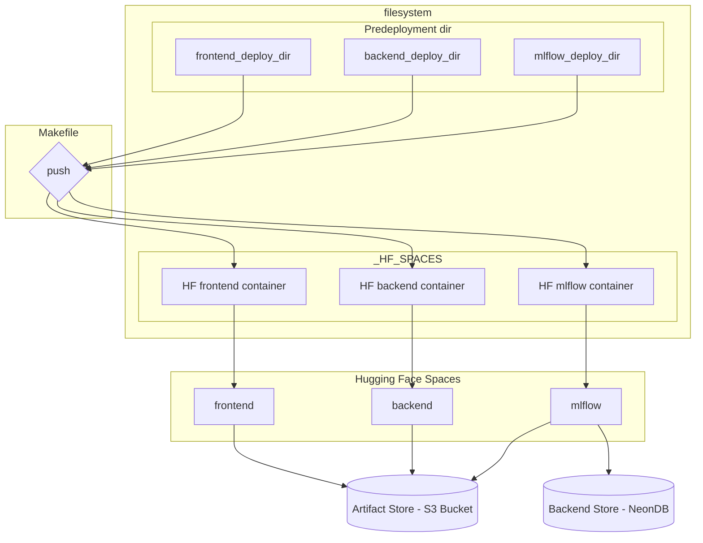

# Project architecture 🧱

[🔙 Back to README](../README.md#table-of-contents)

# Table of Contents 🗂️

- [Project architecture 🧱](#project-architecture-)
- [Table of Contents 🗂️](#table-of-contents-️)
- [Project structure 🌳](#project-structure-)
  - [TL;DR](#tldr)
  - [Detailed structure](#detailed-structure)
  - [Local predeployment 🏗️](#local-predeployment-️)
  - [Hugging Face Spaces deployment 🤗](#hugging-face-spaces-deployment-)


# Project structure 🌳

## TL;DR 
```
.
├── _CONF                           # specific configuration of servers for deployment on HF Spaces
├── _fastapi-backend-server         # api-backend server configuration                
├── _fastapi-server                 # frontend server configuration
├── _fastapi-servers-shared         # shared route for backend and frontend api (for DRY code purpose)
├── _streamlit-server               # dashboard server configuration
├── _nginx-server                   # reverse proxy server configuration
├── _mlflow-server                  # mlflow server configuration
├── data                            # use for local dev
├── pipeline                        # src dir for etl and train processing and general & reusable src
├── models                          # use for local dev - switch to Artifact store in deployment
├── metrics                         # use for local dev - switch to Backend store in deployment
└── notebooks                       # local use, dev, and general test purposes
```

## Detailed structure

<details>
<summary>Detailed structure
 (click to expand)</summary>
```

    .
    ├── _CONF                           # backend & frontend services configuration for <u>deployment on HF Spaces</u>
    │   └── deploy
    │       ├── backend_deploy_dir
    │       │   ├── nginx/              # nginx backend server configuration (home page + reverse proxy service configuration)
    │       │   ├── Dockerfile          # nginx, api-backend, pipeline files, env variables import, ...
    │       │   ├── requirements.txt
    │       │   └── start.sh            # run script: api-backend + nginx
    │       └── frontend_deploy_dir
    │           ├── nginx/              # nginx frontend server configuration (different home page, different API)
    │           ├── Dockerfile          # nginx, streamlit, api, pipeline files, env variables import, ...
    │           ├── requirements.txt
    │           └── start.sh            # run script: streamlit + api + nginx
    ├── _fastapi-backend-server         # api-backend server configuration + src
    │   ├── Dockerfile
    │   ├── requirements.txt
    │   └── src
    │       ├── fastapi.py              # use of routes to separate functional parts)
    │       ├── route_auth.py           # authentification route with cookie setting and checking (dummy hard coded pwd only for POC)
    │       ├── route_extract.py        # extraction route (dummy deserialization from AWS S3 Bucket) - to be replaced by a real one
    │       ├── route_train.py          # train route (random forest classifier for POC) - to be replaced
    │       ├── route_transform.py      # tranform route (dummy column tranformation in dataset for POC) - to be replaced
    │       └── shared                  
    ├── _fastapi-server                 # frontend server configuration + src
    │   ├── Dockerfile
    │   ├── requirements.txt
    │   └── src
    │       ├── fastapi.py
    │       └── shared
    ├── _fastapi-servers-shared         # shared route: routes that are shared by backend and frontend api (for DRY code purpose)
    │   └── src
    │       ├── route_load.py
    │       └── route_predict.py
    ├── _streamlit-server               # dashboard server configuration
    │   ├── Dockerfile
    │   ├── requirements.txt
    │   └── src
    │       └── streamlit.py            # only for display reason - calls api whenever possible
    ├── _nginx-server                   # reverse proxy server configuration. Redirect incoming requests on every listening service
    │   ├── default.conf.templ          # contains PORTS defined as .env variables. File modified by make compose and copied to default.conf
    │   └── html
    │       ├── img
    │       └── index.html
    ├── _mlflow-server                  # mlflow server orchestration configuration dir
    │   ├── Dockerfile
    │   ├── requirements.txt
    │   └── run.sh
    ├── assets                          # project documentation purpose
    │   └── screenshots
    ├── data                            # use for local dev - mounted as a volume - switch to mlflow in deployment
    │   ├── processed
    │   └── raw
    |       ├── df_cars.pkl             # cars dataset
    │       └── df_rentals.pkl          # rentals dataset
    ├── docs
    │   ├── 01-architecture.md
    │   ├── 02-prerequisites.md
    │   ├── 03-local_development.md
    │   ├── 04-pipeline.md
    │   └── 05-deployment.md
    ├── pipeline                        # src dir for etl and train processing and general & reusable src (aws connection, )
    │   ├── core
    │   │   ├── src
    │   │   │   ├── extract.py
    │   │   │   ├── load.py
    │   │   │   ├── predict.py
    │   │   │   └── train.py
    │   │   └── tests
    │   └── libs
    │       ├── src
    │       │   ├── aws.py
    │       │   └── utils.py
    │       └── tests
    ├── models                          # use for local dev - mounted as a volume - switch to Artifact store (S3) in deployment
    ├── metrics                         # use for local dev - mounted as a volume - switch to Backend store (Postgres/NeonDB) in deployment
    ├── notebooks                       # local use, dev, and general test purposes. Left here as sandboxes
    │   ├── Dummy.ipynb                 # local tests notebook - may use data/ metrics/ or models/
    │   ├── EDA.ipynb
    │   ├── ETL.ipynb
    │   └── train.ipynb
    ├── docker-compose.yml              # defines the different services that are launched by Makefile (make compose)
    ├── Makefile                        # switch to compose (local dev) or deploy mode -> read file doc
    └── .env                            # env files to be completed with private keys - Need also to be set as SECRETS in HF Spaces

</details>

[⬆ Back to top](#table-of-contents)

# Deployment Workflows

## Local development 🏠

<details>
<summary> Local development 🏠 (click to expand)</summary>


</details>

[⬆ Back to top](#table-of-contents)

## Local predeployment 🏗️

<details>
<summary>Local predeployment 🏗️ (click to expand)</summary>


</details>

[⬆ Back to top](#table-of-contents)

## Hugging Face Spaces deployment 🤗

<details>
<summary>Hugging Face Spaces deployment 🤗 (click to expand)</summary>


</details>

[⬆ Back to top](#table-of-contents)